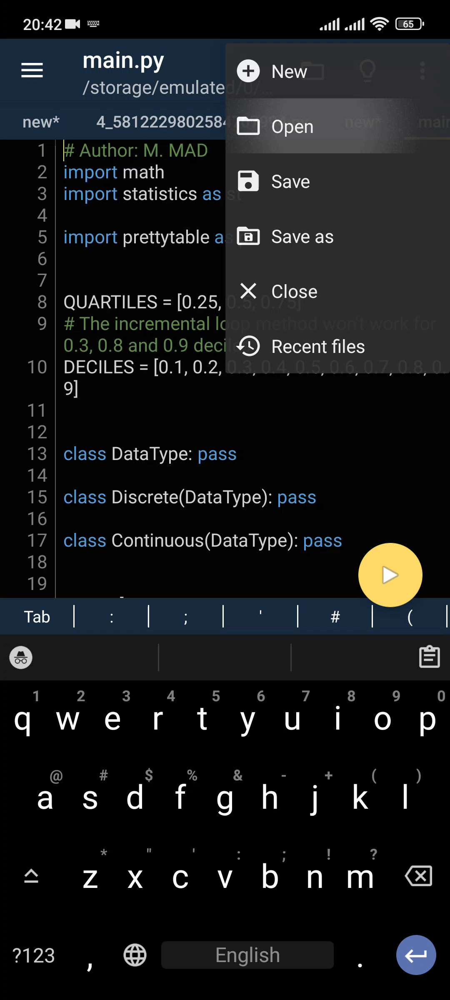
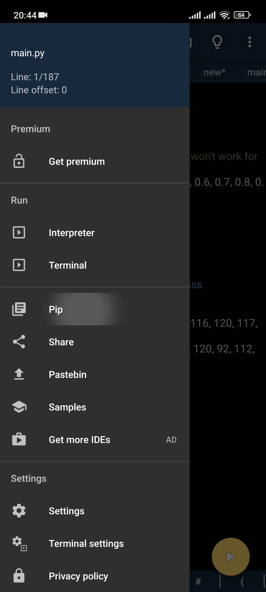
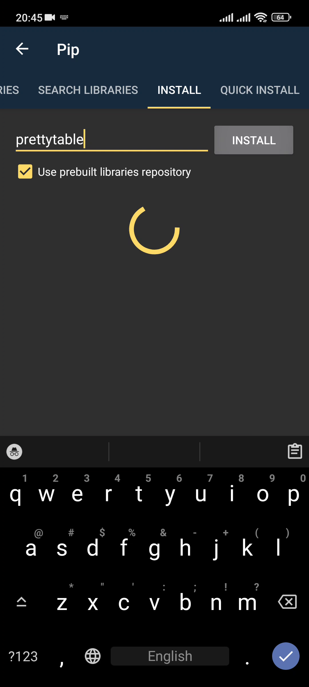

# Installation guide for Android (using PyDroid3)
Android installation can be done in two ways, one way is to use PyDroid3 and
the other (also recommended) one is using the Termux app. Using PyDroid3 is
more straight forward but it have some issues rendering the Frequency
Distribution Table.

1. Install PyDroid3 from
[Google Play Store](https://play.google.com/store/apps/details?id=ru.iiec.pydroid3).
2. Download the program zip file from the
[GitHub Releases](https://github.com/M-MAD-Official/Descriptive_Statistics_Mobile/releases)
and extract it to a folder.
3. Open up PyDroid3 and tap the ⋮ (three dots) button on the top-right
corner of the screen, then tap the `Open`.

Now navigate to the folder you have extracted the downloaded program zip file
to and select `main.py`.
4. Now tap the ☰ (three lines) button on the top-left corner of the screen,
then tap the `Pip`.

5. Go to the `INSTALL` tab and type `prettytable` in the input box, then tap
the `INSTALL` Button.

6. Now go back using the ← (left backward arrow) button on the top-left corner
of the screen, and tap the yellow ▶️ (play) button to run the program.
